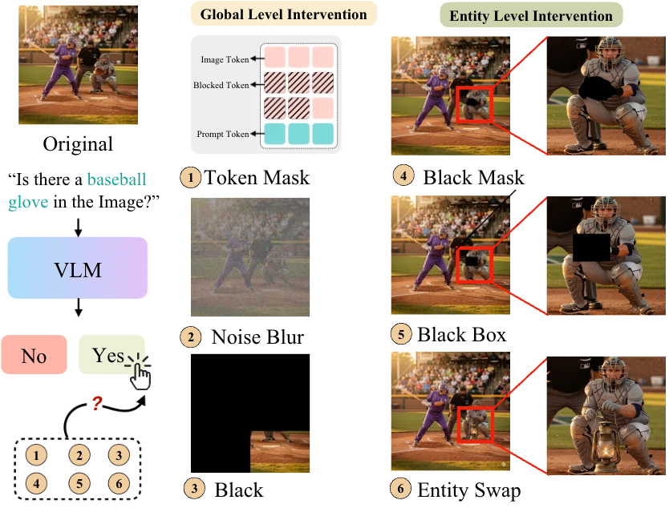

# Seeing Without Looking: Visual Dependency in Vision-Language Models

[](https://arxiv.org/abs/2605.22903)



## Overview


## Installation

```bash
pip install -r requirements.txt
python -m spacy download en_core_web_lg  # for AMBER evaluation
```

## Models

| Model | HuggingFace ID |
|-------|---------------|
| Qwen3-VL-32B | `Qwen/Qwen3-VL-32B-Instruct` |
| InternVL3-8B | `OpenGVLab/InternVL3-8B` |
| Qwen3-VL-8B | `Qwen/Qwen3-VL-7B-Instruct` |
| Gemma3-12B | `google/gemma-3-12b-it` |
| Qwen3-VL-4B | `Qwen/Qwen3-VL-4B-Instruct` |
| LLaVA-1.5-7B | `llava-hf/llava-1.5-7b-hf` |
| Molmo-7B-D-0924 | `allenai/Molmo-7B-D-0924` |

## Quick Start

```bash
# POPE (auto-downloaded from HuggingFace)
python Pope_Eval/eval_llava.py
python Pope_Eval/eval_internvl.py

# MME
python MME_Eval/eval_mme_qwen.py --metadata_path /path/to/metadata.json --root_dir /path/to/mme

# A-OKVQA
python Aokvqa_Eval/eval_aokvqa_qwen.py --pack_root /path/to/aokvqa_pack

# AMBER
python Amber_Eval/eval_amber_generative_qwen.py --amber_dir /path/to/AMBER
```

## Citation
 
```bibtex
@inproceedings{lan2026seeing,
  title={Seeing without Looking: Do Vision-Language Benchmarks Really Test Vision?},
  author={Lan, Zixuan and Sun, Luzhe and Walter, Matthew R and Zhou, Jiawei},
  booktitle={Proceedings of the IEEE/CVF Conference on Computer Vision and Pattern Recognition},
  pages={11260--11273},
  year={2026}
}
```
